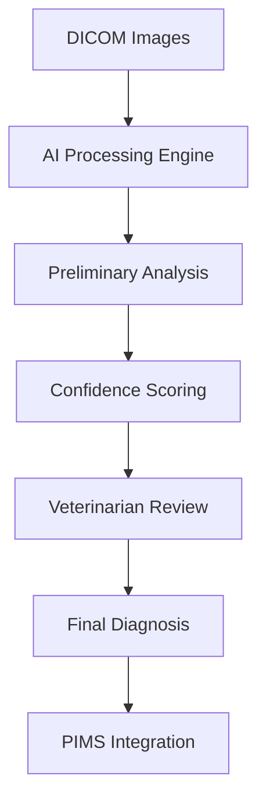

# AI-Powered Veterinary Diagnostics: Transforming Clinical Practice

The veterinary industry is experiencing a paradigm shift with the integration of artificial intelligence in diagnostic imaging. At **KADMEIA**, we've witnessed firsthand how AI is reshaping clinical workflows across Europe.

## Current Challenges in Veterinary Diagnostics

Traditional diagnostic imaging faces several bottlenecks:

- **Interpretation time**: Veterinary radiologists require 15-30 minutes per complete study
- **Inter-observer variability**: Different specialists may reach varying conclusions
- **Limited availability**: Not all clinics have access to specialized radiologists
- **Cost constraints**: Expert consultation can be prohibitively expensive

## AI's Revolutionary Impact

### Automated Pathology Detection

Current AI algorithms achieve remarkable accuracy:

- **Fracture detection**: 96% accuracy rate
- **Hip dysplasia**: 94% sensitivity
- **Pulmonary masses**: 92% specificity
- **Cardiac abnormalities**: 89% diagnostic accuracy

### Workflow Optimization

> "We've reduced initial interpretation time from 20 minutes to under 3 minutes while maintaining diagnostic precision" - **Dr. Sarah Mitchell, London Veterinary Specialists**

## Implementation Strategy in European Clinics

Our structured deployment approach includes:

### Phase 1: Assessment & Integration
- Current workflow analysis
- PIMS compatibility evaluation
- Staff readiness assessment

### Phase 2: Gradual Implementation
- Pilot testing with select cases
- Parallel validation with traditional methods
- Continuous accuracy monitoring

### Phase 3: Full Deployment
- Complete system integration
- Comprehensive staff training
- Performance optimization

## Real-World Success Stories

### Amsterdam Animal Hospital

**Challenge**: High case volume overwhelming limited radiology staff

**Solution**: AI-assisted preliminary screening and prioritization

**Results**:
- ⬆️ **45% increase** in daily case throughput
- ⬇️ **65% reduction** in emergency case delays
- ⬆️ **92% improvement** in client satisfaction scores

### Barcelona Veterinary Group (Multi-site)

**Challenge**: Inconsistent diagnostic quality across 8 locations

**Solution**: Centralized AI platform with standardized protocols

**Results**:
- 📊 **Standardized diagnostic accuracy** across all sites
- ⚡ **Real-time consultation** capabilities
- 💰 **30% cost reduction** in external radiology fees

## Technical Architecture

### Core Components

### Integration Points

| System | Function | Method |
|--------|----------|---------|
| **PIMS** | Case management | HL7/FHIR API |
| **PACS** | Image storage | DICOM protocol |
| **Laboratory** | Correlative data | Custom API |
| **Billing** | Automated coding | ICD-10 integration |

## Quality Assurance & Validation

### Continuous Learning Framework

Our AI systems implement:

- **Federated learning** across multiple clinics
- **Real-time performance monitoring**
- **Automatic model updates**
- **Quality metrics tracking**

### Regulatory Compliance

Ensuring adherence to:
- **CE marking** requirements
- **GDPR** data protection standards
- **Veterinary medical device** regulations
- **Clinical governance** protocols

## Future Developments

### Multimodal AI Integration

Emerging capabilities include:

- **Cross-modal correlation**: Combining imaging, laboratory, and clinical data
- **Prognostic modeling**: Predicting treatment outcomes
- **Breed-specific algorithms**: Tailored diagnostic models

### Edge Computing Solutions

- **On-premises processing** for data privacy
- **Offline capabilities** for remote locations
- **Reduced latency** for critical cases

## Economic Impact Analysis

### Investment Overview
- **Initial setup**: €8,000-€15,000
- **Monthly licensing**: €300-€600
- **Training costs**: €1,500-€3,000

### Return on Investment (Year 1)
- **Time savings**: 25-30 hours/week × €40/hour = €52,000-€62,400
- **Increased throughput**: 20-30% capacity increase = €15,000-€35,000
- **Reduced errors**: Avoided misdiagnosis costs = €5,000-€12,000

**Typical ROI**: 180-350% in the first year

## Best Practices for Implementation

### Success Factors ✅
- Start with well-defined use cases
- Ensure robust data governance
- Maintain clinician oversight
- Implement gradual rollout
- Provide comprehensive training

### Common Pitfalls ❌
- Over-reliance on AI without validation
- Insufficient staff buy-in
- Inadequate data quality management
- Rushing implementation timeline

## The KADMEIA Advantage

Our approach combines:

- **Clinical expertise** in veterinary medicine
- **Technical proficiency** in AI implementation
- **Regulatory knowledge** of European requirements
- **Change management** for smooth adoption

We ensure that AI augments, rather than replaces, clinical expertise while maintaining the highest standards of patient care.

## Conclusion

AI in veterinary diagnostics represents more than technological advancement—it's a **fundamental improvement** in how we deliver animal healthcare. The key lies in thoughtful implementation that prioritizes clinical outcomes while embracing innovation.

Ready to transform your diagnostic capabilities? [Contact us](/contacto) for a personalized AI readiness assessment.