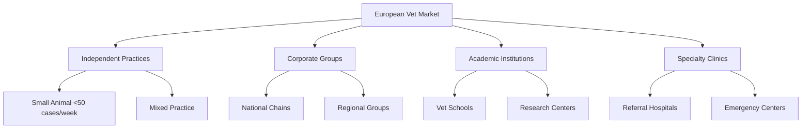

# European Veterinary Market Entry: Strategic Approaches for MedTech Companies

The European veterinary market presents significant opportunities for innovative MedTech companies, but successful entry requires nuanced understanding of regulatory landscapes, distribution networks, and market dynamics. This comprehensive guide explores proven strategies for market penetration.

## Market Landscape Analysis

### Market Size & Growth

The European companion animal healthcare market represents:

- **€7.8 billion** total addressable market (2024)
- **5.2% CAGR** expected through 2027
- **65% digitalization adoption** rate by 2025
- **30+ distinct regulatory** environments

### Key Market Segments

| Segment | Market Share | Growth Rate | Entry Barrier |
|---------|--------------|-------------|---------------|
| **Diagnostics** | 28% | 6.8% | Medium |
| **Therapeutics** | 45% | 4.2% | High |
| **Medical Devices** | 18% | 8.1% | Medium-High |
| **Digital Health** | 9% | 15.3% | Low-Medium |

## Regulatory Framework Navigation

### CE Marking Requirements

For veterinary medical devices:

1. **Classification** under MDR 2017/745
2. **Conformity assessment** procedures
3. **Notified body** involvement (Class IIa and above)
4. **Clinical evidence** requirements
5. **Post-market surveillance** obligations

### Country-Specific Considerations

#### Germany 🇩🇪
- **Bundestierärztekammer** professional oversight
- Strong preference for **clinical evidence**
- **Reimbursement** through insurance schemes

#### France 🇫🇷
- **ANSES** regulatory authority
- **Hospital-centric** distribution model
- **Academic partnerships** highly valued

#### United Kingdom 🇬🇧
- **RCVS** professional standards
- **MHRA** post-Brexit requirements
- **Private practice** dominated market

#### Spain 🇪🇸
- **Regional variations** in adoption
- **Price sensitivity** considerations
- **Distribution partnerships** essential

## Strategic Market Entry Models

### 1. Direct Market Entry

**Advantages:**
- Full control over brand and messaging
- Direct customer relationships
- Higher profit margins

**Requirements:**
- Significant capital investment (€500K-€2M)
- Local regulatory expertise
- Established sales infrastructure

**Best for:** Large companies with proven products and substantial resources

### 2. Distribution Partnerships

**Advantages:**
- Established market presence
- Reduced regulatory burden
- Shared market risk

**Partner Types:**

#### National Distributors
- **Broad geographic coverage**
- **Established customer relationships**
- **Regulatory compliance support**

*Example: Partnership with Kruuse (Denmark) for Scandinavian markets*

#### Specialized Distributors
- **Focused expertise** in specific segments
- **Deep technical support** capabilities
- **Targeted customer base**

*Example: Diagnostic imaging specialists for radiology equipment*

### 3. Strategic Alliances & Joint Ventures

**Structure Options:**
- **Technology licensing** agreements
- **Co-development** partnerships
- **Equity joint ventures**

**Success Case: IDEXX-Covetrus Alliance**
- Combined diagnostic technology with distribution network
- Achieved 40% market share in digital diagnostics within 3 years

## Market Entry Execution Framework

### Phase 1: Market Research & Strategy (Months 1-3)

#### Competitive Intelligence
- **Direct competitors** analysis
- **Indirect solutions** assessment
- **Pricing benchmarks**
- **Value proposition** differentiation

#### Customer Segmentation

### Phase 2: Regulatory & Legal Foundation (Months 2-6)

#### Essential Steps:
1. **CE marking** preparation and submission
2. **Intellectual property** protection
3. **Distribution agreements** structuring
4. **Compliance framework** establishment

### Phase 3: Go-to-Market Execution (Months 4-12)

#### Channel Strategy

**Direct Sales:**
- **Key account management** for large groups
- **Technical specialists** for complex products
- **Digital marketing** for broad reach

**Partner Channel:**
- **Distributor training** programs
- **Co-marketing** initiatives
- **Channel conflict** management

### Phase 4: Scale & Optimize (Months 9-18)

#### Performance Metrics:
- **Market penetration** rate by segment
- **Customer acquisition** cost
- **Revenue per customer**
- **Partner satisfaction** scores

## Pricing Strategy Considerations

### Market-Based Pricing Models

| Country | Price Sensitivity | Reimbursement | Strategy |
|---------|------------------|---------------|----------|
| **Germany** | Low | High | Premium pricing |
| **France** | Medium | Medium | Value-based |
| **Spain** | High | Low | Competitive pricing |
| **UK** | Medium | Low | Outcome-based |

### Value Communication Framework

**Clinical Value:**
- Improved diagnostic accuracy
- Reduced treatment time
- Better patient outcomes

**Economic Value:**
- Operational efficiency gains
- Cost per case reduction
- Revenue enhancement opportunities

## Distribution Partnership Excellence

### Distributor Selection Criteria

#### Essential Qualifications:
- **Market coverage** in target segments
- **Technical capability** for support
- **Regulatory compliance** track record
- **Financial stability**
- **Cultural alignment**

#### Performance Indicators:
- **Revenue targets** achievement
- **Market share** growth
- **Customer satisfaction** scores
- **Training completion** rates

### Partnership Management

**Regular Reviews:**
- Monthly performance meetings
- Quarterly business reviews
- Annual strategic planning

**Support Systems:**
- Technical training programs
- Marketing support materials
- CRM system integration
- Incentive structures

## Digital Transformation Opportunities

### E-commerce Integration

**B2B Platforms:**
- Direct ordering systems
- Inventory management integration
- Automated reordering

**Digital Marketing:**
- Content marketing strategies
- Webinar educational programs
- Social media engagement

### Data-Driven Insights

**Market Intelligence:**
- Customer usage patterns
- Competitive positioning
- Price optimization opportunities

## Risk Management

### Common Pitfalls

**Regulatory Missteps:**
- Inadequate CE marking documentation
- Country-specific requirement oversight
- Post-market surveillance gaps

**Market Execution Errors:**
- Insufficient local market understanding
- Inadequate distributor support
- Price positioning mistakes

### Mitigation Strategies

**Regulatory:**
- Engage local regulatory consultants
- Implement robust quality systems
- Maintain ongoing compliance monitoring

**Commercial:**
- Invest in market research
- Develop comprehensive partner programs
- Establish clear communication protocols

## Success Metrics & KPIs

### Financial Metrics
- **Revenue growth** rate
- **Market share** acquisition
- **Gross margin** achievement
- **ROI** on market entry investment

### Operational Metrics
- **Time to market** for new products
- **Customer acquisition** velocity
- **Partner performance** scores
- **Regulatory compliance** ratings

## The KADMEIA Advantage

Our market entry consulting combines:

- **15+ years** European market experience
- **Regulatory expertise** across all major markets
- **Established distributor** network
- **Clinical advisory** panel
- **Technology integration** capabilities

We provide end-to-end support from initial market assessment through successful commercial launch, ensuring sustainable growth in the European veterinary market.

## Conclusion

Successful European market entry requires careful planning, regulatory compliance, and strategic partnerships. Companies that invest in understanding local market dynamics while building strong distributor relationships typically achieve **2x faster** market penetration and **40% higher** long-term market share.

The key is balancing speed to market with sustainable, compliant growth strategies that build lasting customer relationships.

Ready to enter the European veterinary market? [Contact us](/contacto) for a comprehensive market entry strategy consultation.