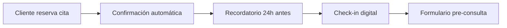
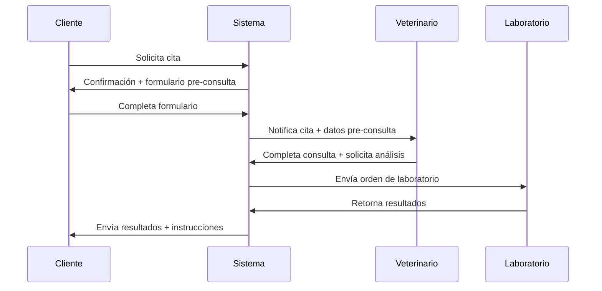

# Automatización de Procesos Clínicos: De la Recepción al Seguimiento

La gestión manual de procesos en clínicas veterinarias consume tiempo valioso que podría dedicarse a la atención del paciente. En este artículo, exploramos cómo automatizar el flujo completo desde la recepción hasta el seguimiento post-consulta.

## Identificando Oportunidades de Automatización

### Procesos Típicos Susceptibles de Automatización

- **Confirmación de citas**: Recordatorios automáticos por SMS/email
- **Check-in digital**: Formularios pre-consulta en dispositivos móviles
- **Gestión de resultados**: Distribución automática de informes
- **Seguimiento post-consulta**: Encuestas de satisfacción y recordatorios de medicación

## Arquitectura del Flujo Automatizado

### 1. Recepción Digital

**Herramientas utilizadas:**
- **Make.com** para orquestación
- **Calendly/Acuity** para reservas
- **Twilio** para SMS
- **Typeform** para formularios

### 2. Durante la Consulta

El veterinario accede instantáneamente a:
- Historial médico completo
- Formulario pre-consulta completado
- Alertas automáticas (vacunas pendientes, alergias)

### 3. Post-Consulta Automatizada

Una vez finalizada la consulta, se activa automáticamente:

1. **Generación de presupuesto** (si aplica)
2. **Programación de próximas citas**
3. **Envío de instrucciones post-consulta**
4. **Integración con laboratorio** (si se requieren análisis)

## Caso Práctico: Clínica Veterinaria Barcelona Norte

### Situación Inicial
- 150 consultas/semana
- 3 horas/día en tareas administrativas por veterinario
- 15% de no-shows en citas

### Implementación
Desarrollamos un flujo automatizado usando **Make.com** que conecta:
- **PIMS Vetersuite** (gestión clínica)
- **WhatsApp Business API** (comunicación)
- **Google Calendar** (agenda)
- **Mailchimp** (email marketing)

### Resultados Tras 3 Meses
- ⬇️ **Reducción del 70%** en tiempo administrativo
- ⬇️ **Disminución del 8%** en no-shows
- ⬆️ **Incremento del 25%** en satisfacción del cliente
- ⬆️ **Aumento del 15%** en ingresos por mayor eficiencia

## Componentes Técnicos de la Automatización

### Integraciones Clave

| Sistema | Función | Herramienta |
|---------|---------|-------------|
| **PIMS** | Gestión clínica central | API nativa |
| **Comunicación** | SMS/WhatsApp/Email | Twilio, WhatsApp Business |
| **Calendario** | Gestión de citas | Google Calendar, Calendly |
| **Pagos** | Facturación automática | Stripe, PayPal |
| **Laboratorio** | Gestión de muestras | API laboratorio |

### Flujo de Datos

## Implementación Gradual: Metodología KADMEIA

### Fase 1: Análisis y Mapeo (Semana 1-2)
- Auditoría de procesos actuales
- Identificación de puntos de fricción
- Mapeo de sistemas existentes

### Fase 2: Prototipo Rápido (Semana 3-4)
- Implementación de flujo básico
- Pruebas con equipo interno
- Ajustes basados en feedback inicial

### Fase 3: Piloto Controlado (Semana 5-8)
- Despliegue con grupo reducido de clientes
- Monitorización de KPIs
- Refinamiento del proceso

### Fase 4: Escalado Completo (Semana 9-12)
- Rollout completo
- Formación de equipo
- Documentación y procedimientos

## ROI de la Automatización

### Inversión Típica
- **Setup inicial**: 2.500-4.000€
- **Licencias mensuales**: 150-300€/mes
- **Formación**: 500-1.000€

### Retorno Esperado (Año 1)
- **Ahorro en tiempo**: 15-20 horas/semana × 25€/hora = 19.500-26.000€
- **Reducción no-shows**: 5-10% × ingresos promedio = 5.000-15.000€
- **Mejora satisfacción**: Incremento 10-15% retención = 8.000-12.000€

**ROI típico**: 200-400% en el primer año

## Mejores Prácticas para la Implementación

### Do's ✅
- Empezar con procesos simples y bien definidos
- Involucrar al equipo desde el diseño
- Mantener always a human backup
- Documentar todos los flujos
- Monitorizar KPIs continuamente

### Don'ts ❌
- Automatizar procesos deficientes sin optimizar primero
- Implementar todo de una vez
- Olvidar la formación del equipo
- Ignorar el feedback de usuarios finales

## Tecnologías Emergentes

### IA Conversacional
Chatbots especializados en veterinaria que pueden:
- Responder FAQs básicas
- Programar citas simples
- Proporcionar instrucciones post-consulta

### Integración con Wearables
Conectividad con dispositivos de monitorización continua:
- Collares inteligentes
- Sensores de actividad
- Monitores de glucosa

## Conclusión

La automatización de procesos clínicos no es solo una tendencia, sino una **necesidad competitiva**. Las clínicas que implementen estos sistemas de forma inteligente verán mejoras significativas en eficiencia, satisfacción del cliente y rentabilidad.

En **KADMEIA**, diseñamos e implementamos soluciones de automatización personalizadas que se adaptan a las necesidades específicas de cada clínica, garantizando una integración sin fricción con los sistemas existentes.

¿Listo para automatizar tu clínica? [Contáctanos](/contacto) para una evaluación gratuita de tus procesos.