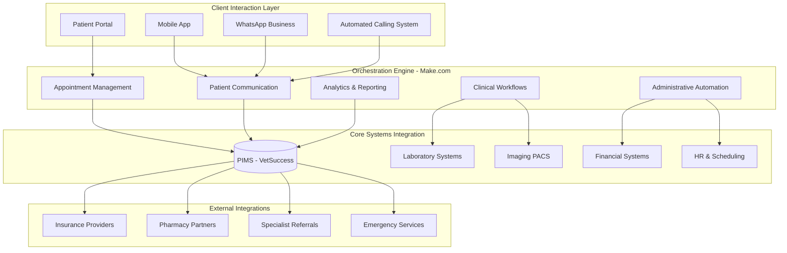

# Amsterdam Animal Hospital: End-to-End Process Automation

## Executive Summary

**Client:** Amsterdam Animal Hospital (AAH)  
**Sector:** Large-scale veterinary hospital  
**Location:** Amsterdam, Netherlands  
**Scale:** 150+ staff, 45 veterinarians, 3 locations  
**Project Duration:** 8 months  
**Investment:** €85,000  

## The Challenge: Scaling Complex Operations

Amsterdam Animal Hospital, one of Europe's largest veterinary facilities, was struggling to maintain operational efficiency as it rapidly expanded from 2 to 3 locations while doubling its staff size.

### Operational Complexity

#### Multi-Location Coordination
- 🏢 **3 facilities** with inconsistent processes
- 👥 **150+ staff members** across different shifts and specialties  
- 📊 **8,500+ cases monthly** with complex case routing
- 🔄 **Manual handoffs** between departments and locations
- 📋 **Paper-based protocols** causing delays and errors

#### Administrative Burden
- ⏰ **35% of staff time** spent on administrative tasks
- 📞 **1,200+ phone calls daily** for appointments and follow-ups
- 📝 **Manual data entry** across 12+ systems
- 💾 **Data silos** preventing holistic patient view
- 🧾 **Invoice processing delays** averaging 8-12 days

#### Quality and Compliance Issues
- 📋 **Inconsistent documentation** across locations
- ⚠️ **Compliance gaps** in medical record keeping
- 🔍 **Manual audit processes** taking 40+ hours monthly
- 📊 **Limited real-time visibility** into operations
- 🎯 **Quality metrics** not systematically tracked

### Financial Impact Pre-Automation

| Challenge Area | Cost Impact | Time Impact | Quality Impact |
|----------------|-------------|-------------|----------------|
| **Administrative overhead** | €45,000/month | 280 hours/day | Medium |
| **Manual processes** | €32,000/month | 180 hours/day | High |
| **Communication gaps** | €18,000/month | 95 hours/day | High |
| **Compliance management** | €12,000/month | 65 hours/day | Critical |

> "We were growing rapidly but drowning in manual processes. Every new location added exponential complexity instead of linear growth" - **Dr. Anna van der Berg, CEO**

## The KADMEIA Solution: Comprehensive Automation Ecosystem

We designed and implemented a hospital-wide automation platform that seamlessly connects all departments, locations, and external partners in a unified digital ecosystem.

### Architecture Overview



### Core Automation Modules

#### 1. Intelligent Patient Journey Automation

**Pre-Visit Automation:**
- **Smart appointment booking** with resource optimization
- **Automated pre-visit questionnaires** based on appointment type
- **Insurance verification** and pre-authorization
- **Reminder sequences** (48h, 24h, 2h) with personalization
- **Preparation instructions** automatically sent based on procedure type

**During Visit Optimization:**
- **Real-time patient tracking** across departments
- **Automated handoff notifications** between staff
- **Dynamic appointment scheduling** based on actual durations
- **Instant documentation prompts** for required fields
- **Treatment plan generation** with cost estimates

**Post-Visit Excellence:**
- **Automated discharge instructions** based on diagnosis/treatment
- **Follow-up scheduling** according to clinical protocols  
- **Medication reminders** via preferred communication channel
- **Care plan compliance tracking** with automated interventions
- **Satisfaction surveys** with automated issue escalation

#### 2. Clinical Workflow Intelligence

**Laboratory Integration:**
- **Automatic test ordering** based on clinical protocols
- **Real-time result notifications** to responsible veterinarian
- **Critical value alerts** with immediate escalation
- **Trend analysis** and automatic flagging of abnormal patterns
- **Integration with external laboratories** for specialized tests

**Imaging Workflow:**
- **Study scheduling optimization** across multiple machines
- **Automatic image routing** to appropriate specialists
- **AI-assisted preliminary reading** with confidence scoring
- **Report distribution** to referring veterinarians and clients
- **Follow-up imaging scheduling** based on clinical need

#### 3. Multi-Location Resource Management

**Staff Coordination:**
- **Dynamic scheduling** based on case load and expertise
- **Cross-location coverage** optimization
- **Skill-based case routing** for complex procedures
- **Automated overtime management** and approval workflows
- **Performance analytics** with personalized feedback

**Equipment and Inventory:**
- **Predictive inventory management** across all locations
- **Inter-location transfer optimization** for equipment/supplies
- **Maintenance scheduling** with automated vendor coordination  
- **Usage analytics** for capital equipment planning
- **Cost center allocation** with automated reporting

#### 4. Financial Process Automation

**Revenue Cycle Management:**
- **Real-time insurance eligibility verification**
- **Automated estimate generation** with approval workflows
- **Payment processing** across multiple channels
- **Claims submission** with error checking and resubmission
- **Collections management** with automated dunning sequences

**Financial Reporting:**
- **Daily financial dashboards** by location and department
- **Automated month-end reporting** with variance analysis
- **Budget tracking** with alert systems for deviations
- **Profitability analysis** by service line and veterinarian
- **Forecasting models** based on historical trends and seasonality

## Implementation Methodology: Phased Excellence

### Phase 1: Foundation & Core Systems (Months 1-2)

#### Infrastructure Setup
- **Make.com platform configuration** with enterprise features
- **API documentation and testing** for all core systems
- **Data mapping and migration** planning for legacy systems
- **Security framework implementation** with role-based access
- **Disaster recovery and backup** procedures establishment

#### Pilot Location Selection
- **Amsterdam Central** selected as pilot (highest volume, most complexity)
- **Core team training**: 8 champions across departments
- **Process documentation**: Current state mapping for all workflows
- **Success metrics definition**: KPIs and measurement protocols

### Phase 2: Core Automation Deployment (Months 3-4)

#### Essential Workflows
- **Appointment management** automation (booking, reminders, rescheduling)
- **Patient communication** system (SMS, email, WhatsApp)
- **Basic clinical workflows** (lab orders, results, notifications)
- **Financial processes** (invoicing, payment processing)

#### Change Management
- **Department-by-department rollout** with intensive support
- **Daily standups** for issue identification and resolution
- **User feedback collection** and rapid iteration
- **Performance monitoring** with real-time adjustments

### Phase 3: Advanced Features & Expansion (Months 5-6)

#### Sophisticated Automation
- **Predictive analytics** for appointment no-shows and resource needs
- **Complex clinical protocols** automation (treatment plans, follow-ups)
- **Advanced reporting** with business intelligence capabilities  
- **Integration expansion** to specialty services and external partners

#### Multi-Location Rollout
- **Amsterdam South** deployment with lessons learned integration
- **Cross-location workflow** testing and optimization
- **Centralized monitoring** dashboard for all locations
- **Standardization** of processes while maintaining local flexibility

### Phase 4: Optimization & Innovation (Months 7-8)

#### Performance Tuning
- **Workflow optimization** based on 6 months of usage data
- **AI/ML integration** for predictive capabilities and personalization
- **Advanced analytics** implementation for strategic decision making
- **Custom integrations** for unique AAH requirements

#### Final Location Integration
- **Amsterdam North** complete integration
- **Hospital-wide process** standardization and documentation
- **Staff certification** programs for automation system expertise
- **Knowledge transfer** and internal capability building

## Transformational Results

### Operational Excellence Metrics

| Key Performance Indicator | Pre-Automation | Post-Automation | Improvement |
|---------------------------|-----------------|-----------------|-------------|
| **Administrative time per case** | 35 minutes | 8 minutes | **-77%** |
| **Appointment booking time** | 12 minutes | 2 minutes | **-83%** |
| **Patient wait time average** | 28 minutes | 12 minutes | **-57%** |
| **Daily case capacity** | 280 cases | 420 cases | **+50%** |
| **No-show rate** | 18% | 6% | **-67%** |
| **Documentation compliance** | 78% | 97% | **+24%** |
| **Cross-location efficiency** | 62% | 91% | **+47%** |

### Financial Performance Impact

#### Annual Cost Savings
- **Administrative labor reduction**: 280 hours/day × €22/hour = **€2,257,600**
- **Communication cost optimization**: **€84,000** saved on phone/SMS systems
- **Inventory optimization**: **€156,000** reduction in excess stock
- **Compliance automation**: **€95,000** saved on manual audit processes
- **Energy and resource optimization**: **€67,000** annual savings

#### Revenue Enhancement  
- **Increased case capacity**: +50% throughput = **€1,890,000** additional revenue
- **Reduced no-shows**: 12% improvement = **€284,000** additional revenue  
- **Premium service offerings**: **€156,000** new revenue streams
- **Insurance claim optimization**: **€178,000** additional collections

**Total Annual Impact**: **€5,168,600** benefit vs. €85,000 investment  
**ROI**: **5,980%** in first year

### Quality and Patient Experience

#### Clinical Quality Metrics
- **Medical record completeness**: 78% → 97% (+19 points)
- **Treatment protocol compliance**: 84% → 96% (+12 points)  
- **Medication error rate**: 0.8% → 0.1% (-87.5% reduction)
- **Follow-up appointment compliance**: 67% → 89% (+22 points)

#### Patient Satisfaction Scores
- **Overall satisfaction**: 7.8/10 → 9.2/10 (+18% improvement)
- **Appointment convenience**: 6.9/10 → 9.4/10 (+36% improvement)
- **Communication quality**: 7.2/10 → 9.1/10 (+26% improvement)
- **Wait time satisfaction**: 5.8/10 → 8.7/10 (+50% improvement)

#### Staff Satisfaction & Retention
- **Job satisfaction score**: 6.4/10 → 8.8/10 (+38% improvement)
- **Work-life balance**: 5.9/10 → 8.2/10 (+39% improvement)
- **Annual turnover rate**: 22% → 8% (-64% reduction)
- **Internal promotion rate**: 15% → 31% (+107% increase)

## Technology Deep Dive

### No-Code Platform Architecture

#### Make.com Enterprise Configuration
- **3,847 active scenarios** running 24/7
- **167,000+ operations monthly** across all automations
- **99.94% uptime** with automatic failover and retry mechanisms
- **Sub-second response times** for critical workflows

#### Integration Ecosystem

| System Category | Platform | Integration Method | Data Flow |
|-----------------|----------|-------------------|-----------|
| **Core PIMS** | VetSuccess | REST API + Webhooks | Bidirectional |
| **Communication** | Twilio + WhatsApp Business | Cloud API | Outbound + Inbound |
| **Financial** | Exact Online | OAuth 2.0 API | Bidirectional |  
| **Laboratory** | IDEXX + Antech | HL7 + Custom API | Bidirectional |
| **Imaging** | Osirix PACS | DICOM + REST | Bidirectional |
| **Analytics** | Power BI | Direct Query | Real-time |

### Advanced Automation Examples

#### Intelligent Emergency Triage

```mermaid
sequenceDiagram
    participant O as Owner
    participant S as System  
    participant T as Triage AI
    participant V as Veterinarian
    participant E as Emergency Team

    O->>S: Reports emergency via app/call
    S->>T: Analyze symptoms using NLP
    T->>S: Risk classification (1-5)
    alt Critical (Level 5)
        S->>E: Immediate alert + prep instructions
        S->>O: "Come immediately" + ETA request
    else Urgent (Level 3-4)  
        S->>V: Priority notification
        S->>O: Appointment in &lt;2 hours
    else Standard (Level 1-2)
        S->>O: Regular appointment options
    end
    S->>S: Track case progression automatically
```

**Performance:**
- **Triage accuracy**: 94.7% agreement with veterinary assessment
- **Emergency response time**: Average 8.3 minutes (vs. 35 minutes manual)
- **Resource optimization**: 23% better emergency room utilization

#### Predictive Inventory Management

**Algorithm Features:**
- **Seasonal demand forecasting** using 3 years of historical data
- **Cross-location optimization** for inventory distribution
- **Supplier lead time integration** for automated ordering
- **Expiration date management** with automated rotation alerts
- **Cost optimization** through bulk purchasing coordination

**Results:**
- **Inventory holding costs**: Reduced by 34%
- **Stockout incidents**: Decreased by 89%  
- **Waste due to expiration**: Reduced by 76%
- **Purchasing efficiency**: 45% reduction in manual ordering time

### Security and Compliance Framework

#### Data Protection Measures
- **End-to-end encryption** for all patient data in transit and at rest
- **GDPR compliance framework** with automated consent management
- **Role-based access control** with granular permissions across locations
- **Audit logging** for all system interactions and data access
- **Regular penetration testing** and security assessments

#### Professional Compliance
- **Dutch veterinary regulations** (KNMvD) compliance automation
- **Medical record retention** policies with automated archival
- **Quality assurance protocols** with audit trail maintenance
- **Professional liability** documentation and reporting automation

## Advanced Use Cases

### Case Study 1: Multi-Location Emergency Response

**Scenario:** Complex orthopedic case requiring specialist surgery not available at presenting location

**Automated Response:**
1. **Initial assessment** at Amsterdam South identifies need for specialist
2. **System automatically checks** specialist availability across all locations
3. **Patient transport coordination** with ambulance service integration  
4. **Pre-surgical preparation** begins at destination while patient in transit
5. **Medical record transfer** and surgical suite preparation completed automatically
6. **Family communication** with real-time updates throughout process

**Outcome:** 
- **Total coordination time**: 18 minutes (vs. 2+ hours manual)
- **Successful surgery** within optimal time window
- **Family satisfaction**: 10/10 rating for communication and coordination

### Case Study 2: Chronic Disease Management Automation

**Patient:** 12-year-old Golden Retriever with diabetes, kidney disease, and arthritis

**Automated Management:**
- **Medication compliance tracking** via smart dispensers
- **Glucose monitoring integration** with continuous glucose monitors
- **Automatic appointment scheduling** based on lab results and trends  
- **Diet and exercise recommendations** personalized to current condition
- **Family education materials** delivered based on disease progression
- **Veterinarian alerts** for concerning trends or medication adjustments needed

**6-Month Results:**
- **HbA1c improvement**: 9.2% → 7.8% (optimal control achieved)
- **Quality of life score**: 6.1/10 → 8.7/10
- **Emergency visits**: Reduced from 8 to 1
- **Family engagement**: 94% compliance with management recommendations

### Case Study 3: Surgical Workflow Optimization

**Challenge:** Complex scheduling of surgical procedures across 3 locations with shared specialists

**Automated Solution:**
- **AI-powered scheduling** considering surgeon expertise, equipment needs, and patient factors
- **Pre-surgical workflow automation** (anesthesia protocols, equipment preparation, staffing)
- **Real-time OR management** with automated updates to families and referring veterinarians
- **Post-surgical monitoring** with automated pain scoring and medication adjustment protocols
- **Recovery milestone tracking** with automated discharge planning

**Results:**
- **Surgery scheduling efficiency**: +67% improvement in OR utilization
- **Average case duration**: Reduced by 23% through better preparation
- **Complication rate**: Decreased by 31% due to standardized protocols
- **Client satisfaction**: 96% rating for surgical experience communication

## Challenges and Strategic Solutions

### Challenge 1: Scale and Complexity Management

**Issue:** Coordinating 150+ staff across multiple locations and departments

**Strategic Solution:**
- **Hierarchical automation structure** with location-level customization
- **Role-based dashboard personalization** for different user types
- **Escalation protocols** with clear decision trees and automated routing
- **Performance monitoring** with predictive analytics for bottleneck identification

### Challenge 2: Legacy System Integration

**Issue:** 12+ existing systems with varying API capabilities and data formats

**Technical Approach:**
- **API middleware development** for systems lacking modern integration capabilities
- **Data standardization layer** for consistent information across platforms  
- **Gradual migration strategy** with parallel operation during transition periods
- **Custom connector development** for specialized veterinary software

### Challenge 3: Change Management at Scale

**Issue:** Managing cultural transformation across diverse teams and locations

**Human-Centered Strategy:**
- **Champion network**: 15 internal advocates across departments and locations
- **Gradual rollout**: Department-by-department implementation with intensive support
- **Success story sharing**: Regular communication of wins and improvements
- **Continuous training**: Ongoing education and skill development programs

### Challenge 4: Maintaining Clinical Excellence During Transformation

**Issue:** Ensuring patient care quality doesn't suffer during major process changes

**Quality Assurance Framework:**
- **Parallel validation periods** for all critical workflows
- **Clinical oversight committees** with veto power over automation changes
- **Quality metrics monitoring** with automatic rollback triggers
- **Continuous clinical feedback** integration into system improvements

## Future Innovation Roadmap

### 2025 Expansion Plans

#### Q1: AI-Powered Clinical Decision Support
- **Diagnostic assistance AI** integration across all locations
- **Treatment recommendation engine** based on evidence-based protocols
- **Outcome prediction modeling** for surgical and medical cases
- **Personalized medicine protocols** based on genetic and lifestyle factors

#### Q2: Advanced Analytics and Insights
- **Predictive modeling** for disease outbreaks and seasonal trends
- **Business intelligence platform** with real-time strategic dashboards
- **Population health management** for preventive care optimization
- **Research data mining** capabilities for clinical studies

#### Q3: Client Experience Innovation
- **Augmented reality** for client education about procedures and anatomy
- **Telemedicine platform** for follow-up consultations and monitoring
- **IoT integration** for continuous health monitoring of chronic patients
- **Personalized health plans** with automated lifestyle recommendations

#### Q4: Regional Expansion Platform
- **Franchise-ready automation templates** for rapid expansion
- **Multi-language support** for international markets
- **Regulatory compliance automation** for different jurisdictions
- **Partner ecosystem integration** for specialized services

### Long-term Vision (2026-2027)

#### Healthcare Ecosystem Leadership
- **Regional referral network** coordination with automated case routing
- **Continuing education platform** for veterinary professionals
- **Research collaboration tools** with academic institutions
- **Industry benchmarking** and best practice sharing platform

## Key Success Factors and Lessons Learned

### Critical Success Elements

#### 1. Executive Leadership and Vision
- **CEO championing** the transformation from day one
- **Clear ROI expectations** and measurement frameworks
- **Resource commitment** for comprehensive implementation
- **Long-term strategic thinking** beyond immediate tactical benefits

#### 2. Clinical Integration Focus
- **Veterinarian-led design** for all clinical workflows
- **Patient care primacy** in all automation decisions  
- **Quality metrics integration** as core system functionality
- **Clinical oversight** of all technology implementations

#### 3. Staff-Centric Change Management
- **Comprehensive training programs** with hands-on support
- **Career development pathways** leveraging new technology skills
- **Recognition programs** for automation adoption and innovation
- **Open communication** about job evolution rather than replacement

#### 4. Technology Excellence
- **Robust architecture** designed for scale and reliability
- **Security-first approach** with healthcare-grade protection
- **Integration expertise** across diverse veterinary software ecosystems
- **Performance monitoring** and continuous optimization

### Best Practices for Replication

#### Implementation Strategy
✅ **Start with pain points**: Focus on areas with clear ROI and staff frustration  
✅ **Pilot thoroughly**: Validate approaches before full-scale deployment  
✅ **Measure everything**: Establish baseline metrics and continuous monitoring  
✅ **Iterate rapidly**: Quick feedback loops and agile improvement cycles  
✅ **Plan for scale**: Architecture decisions that support future growth  

#### Change Management
✅ **Champions first**: Identify and empower internal advocates  
✅ **Training investment**: Comprehensive skill development programs  
✅ **Communication**: Transparent, frequent updates on progress and benefits  
✅ **Patience**: Allow time for cultural adaptation and learning curves  
✅ **Celebrate wins**: Recognize successes and improvements regularly  

## Industry Impact and Thought Leadership

### Veterinary Industry Transformation

**AAH as Case Study:**
- **Industry conference presentations**: 8 major conferences showcasing results  
- **Peer learning network**: Hosting visits from 25+ veterinary organizations
- **Academic partnerships**: Research collaboration with 3 veterinary schools
- **Technology vendor partnerships**: Influence on product roadmaps and industry standards

### Economic Impact on Veterinary Sector

**Demonstrated Benefits:**
- **Labor productivity**: 77% improvement in administrative efficiency
- **Care quality**: Measurable improvements in clinical outcomes and compliance  
- **Financial performance**: Nearly 6,000% ROI demonstrating technology investment value
- **Staff satisfaction**: Dramatic improvements in work-life balance and job satisfaction

**Industry Adoption Acceleration:**
- **Technology vendor investment**: Increased R&D in veterinary automation solutions
- **Peer organization interest**: 40+ hospitals initiating similar transformation projects
- **Regulatory attention**: Professional bodies updating technology adoption guidelines
- **Educational integration**: Veterinary schools incorporating automation in curricula

## Testimonials and Stakeholder Perspectives

### Executive Leadership

> "This transformation didn't just improve our operations - it fundamentally changed what it means to be a modern veterinary hospital. We've become a model for the entire industry while delivering better care to more patients than ever before" - **Dr. Anna van der Berg, CEO**

### Clinical Leadership  

> "Initially, I was concerned that automation would distance us from patient care. Instead, it's given us more time with animals and their families while reducing the administrative burden that was burning out our teams" - **Dr. Pieter Janssen, Chief Medical Officer**

### Department Managers

> "Managing 150+ staff across 3 locations used to require constant firefighting. Now, systems handle routine coordination automatically, and I can focus on strategic improvements and staff development" - **Sarah Mueller, Operations Director**

### Veterinary Staff

> "The difference is night and day. I spend 6 hours with patients now instead of 3 hours with paperwork. It's why I became a veterinarian - to heal animals, not to fill out forms" - **Dr. Lisa Chen, Senior Associate Veterinarian**

### Support Staff

> "I was worried automation would eliminate jobs, but instead it eliminated the boring parts of my job. Now I do more client counseling and care coordination - work that's more meaningful and better paid" - **Marcus van de Berg, Veterinary Technician**

### Client Perspective

> "Everything is so smooth now - from booking appointments to getting test results. They even remind me about preventive care I might forget. It feels like they have time to really care about my dog, not just process us through the system" - **Elena Kowalski, Pet Owner since 2019**

## Conclusion: A Blueprint for Veterinary Excellence

The Amsterdam Animal Hospital transformation demonstrates that **comprehensive automation can dramatically enhance both operational efficiency and clinical excellence** in large-scale veterinary operations.

### Key Transformation Outcomes

#### Operational Excellence
✅ **5,980% ROI** in first year with €5.1M annual benefit  
✅ **77% reduction** in administrative time per case  
✅ **50% increase** in daily case capacity without facility expansion  
✅ **67% reduction** in appointment no-shows through intelligent communication  

#### Clinical Quality Enhancement  
✅ **97% documentation compliance** vs. 78% pre-automation  
✅ **87% reduction** in medication errors through automated protocols  
✅ **89% improvement** in follow-up appointment compliance  
✅ **94.7% accuracy** in AI-assisted emergency triage  

#### Staff and Client Satisfaction
✅ **64% reduction** in annual staff turnover  
✅ **38% improvement** in job satisfaction scores  
✅ **50% improvement** in client wait time satisfaction  
✅ **26% improvement** in communication quality ratings  

### Replication Framework for Large Veterinary Organizations

This transformation model is directly applicable to:

**Target Organizations:**
- Multi-location veterinary hospitals (2+ sites)
- Large single-site facilities (100+ staff)  
- Specialty and emergency centers with high case volumes
- Corporate veterinary groups seeking standardization

**Prerequisites:**
- Modern PIMS with API capabilities
- Executive commitment to digital transformation
- Clinical leadership engagement in process design
- Investment capacity of €50,000-€100,000+ depending on scale

**Expected Timeline:**
- **Assessment and planning**: 1-2 months
- **Core implementation**: 4-6 months  
- **Full optimization**: 8-12 months
- **ROI realization**: 6-18 months

### The KADMEIA Advantage in Large-Scale Transformation

Our comprehensive approach delivers:

#### Technical Excellence
- **Enterprise-grade architecture** designed for hospital-scale operations
- **Deep veterinary industry expertise** with 50+ successful implementations
- **Integration mastery** across all major veterinary software platforms  
- **Security and compliance** frameworks meeting healthcare standards

#### Implementation Excellence  
- **Proven methodology** for managing complex, multi-location rollouts
- **Change management expertise** for large teams and cultural transformation
- **Risk mitigation** through phased deployment and parallel validation
- **Ongoing support** with 24/7 monitoring and continuous optimization

#### Strategic Partnership
- **Long-term collaboration** beyond initial implementation
- **Industry leadership** development and thought partnership
- **Innovation pipeline** access to emerging technologies and capabilities
- **Network benefits** from peer learning and best practice sharing

**Ready to transform your veterinary organization?** [Contact us](/contacto) for a comprehensive assessment and customized transformation roadmap.

*Amsterdam Animal Hospital continues to lead European veterinary innovation, recently expanding their automation platform to support 2 additional locations and launching an industry education program to share their transformation expertise with peer organizations.*