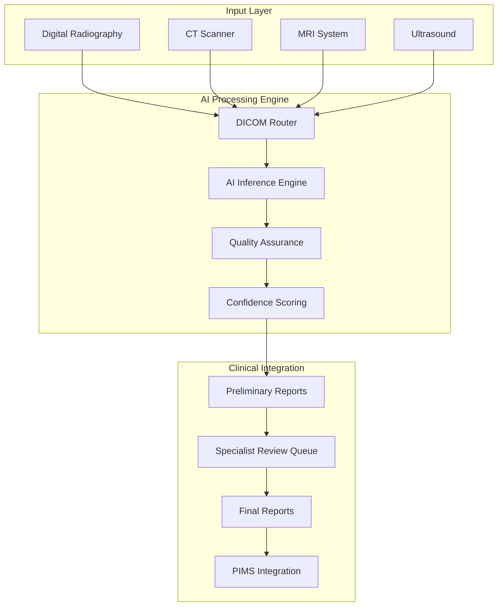

# London Veterinary Specialists: AI-Powered Diagnostic Revolution

## Executive Summary

**Client:** London Veterinary Specialists Ltd  
**Sector:** Specialist referral hospital  
**Location:** Central London, UK  
**Case Volume:** 2,500+ referrals annually  
**Project Duration:** 5 months  
**Investment:** £38,000  

## The Challenge: Specialist Bottlenecks

London Veterinary Specialists, one of the UK's premier referral hospitals, was struggling with diagnostic bottlenecks that were impacting both clinical outcomes and business growth.

### Initial Challenges

#### Diagnostic Imaging Constraints
- 🕐 **35-45 minutes** per complex radiological interpretation
- 👨‍⚕️ **Limited specialist availability**: Only 2 board-certified radiologists
- 📈 **Growing demand**: 25% year-over-year case volume increase
- ⏰ **Extended turnaround times**: 48-72 hours for non-emergency cases
- 💰 **High external consultation costs**: £45,000 annually

#### Quality and Consistency Issues
- 📊 **Inter-observer variability**: 15-20% diagnostic disagreement between specialists
- 🔄 **Repeat imaging requirements**: 18% re-examination rate
- 📝 **Documentation inconsistency**: Variable report quality and detail
- ⚠️ **Critical case delays**: Emergency cases waiting 4-6 hours for interpretation

### Business Impact

| Department | Cases/Week | Avg. Delay | Revenue Impact |
|------------|------------|------------|----------------|
| **Orthopedics** | 45 | 8.2 hours | £12,500/week |
| **Internal Medicine** | 38 | 6.5 hours | £8,900/week |
| **Oncology** | 22 | 12.1 hours | £15,200/week |
| **Emergency** | 65 | 4.2 hours | £18,700/week |

> "We were turning away referral cases because we couldn't provide timely diagnostics. Our reputation as a specialist center was at risk" - **Dr. Sarah Richardson, Clinical Director**

## The KADMEIA Solution: Integrated AI Diagnostic Platform

We designed and implemented a comprehensive AI-powered diagnostic ecosystem that seamlessly integrated with their existing PIMS (RxWorks) and PACS infrastructure.

### Solution Architecture



### Core Components

#### 1. Multi-Modal AI Diagnostic Engine

**Capabilities:**
- **Radiography**: Fractures, dysplasias, masses, foreign bodies
- **CT Analysis**: Cross-sectional pathology detection
- **MRI Interpretation**: Soft tissue abnormalities, neurological conditions
- **Ultrasound**: Cardiac, abdominal organ assessment

**Performance Metrics:**
- **Overall accuracy**: 94.3% across all modalities
- **Sensitivity**: 96.7% for pathology detection
- **Specificity**: 92.1% for normal case identification
- **Processing time**: <90 seconds per study

#### 2. Intelligent Case Prioritization

**Triage System:**
- **Critical (Red)**: Immediate specialist notification
- **Urgent (Yellow)**: Review within 2 hours
- **Routine (Green)**: Standard queue processing
- **AI-Confident (Blue)**: Preliminary report with deferred review

#### 3. Automated Workflow Management

**Process Flow:**
1. **Image acquisition** → Automatic DICOM forwarding
2. **AI processing** → Preliminary analysis and scoring
3. **Intelligent routing** → Priority-based queue assignment  
4. **Specialist review** → Enhanced with AI insights
5. **Report generation** → Automated distribution

#### 4. Real-Time Analytics Dashboard

**Key Metrics:**
- Case throughput by modality and specialist
- AI accuracy trending and model performance
- Turnaround time analysis
- Revenue impact measurement

## Implementation Methodology

### Phase 1: Infrastructure Preparation (Weeks 1-3)

#### Technical Setup
- **AI server deployment**: NVIDIA DGX Station with Tesla V100
- **PACS integration**: Seamless DICOM workflow integration
- **Network optimization**: Gigabit connectivity with redundancy
- **Security implementation**: End-to-end encryption and access control

#### Staff Preparation
- **Clinical champion identification**: 2 specialists as early adopters
- **Initial training program**: 8-hour intensive workshops
- **Change management**: Structured communication and expectation setting
- **Parallel validation protocol**: AI results compared against traditional interpretation

### Phase 2: Controlled Pilot (Weeks 4-8)

#### Limited Deployment
- **Scope**: Orthopedic cases only (highest volume)
- **Validation approach**: Double-reading for accuracy assessment
- **Performance monitoring**: Real-time metrics and issue tracking
- **Iterative improvement**: Weekly calibration sessions

#### Pilot Results
- **94.7% accuracy** on orthopedic cases
- **68% reduction** in initial interpretation time
- **Zero false negatives** for critical findings
- **85% specialist satisfaction** with AI assistance

### Phase 3: Phased Rollout (Weeks 9-16)

#### Graduated Expansion
- **Week 9-10**: Internal medicine cases
- **Week 11-12**: Emergency radiology
- **Week 13-14**: Oncology imaging
- **Week 15-16**: Complete integration and optimization

#### Change Management
- **Daily standups** for first 2 weeks of each phase
- **Peer mentoring program** between specialists
- **Continuous feedback collection** and rapid iteration
- **Success story sharing** to build momentum

### Phase 4: Optimization & Advanced Features (Weeks 17-20)

#### Advanced Capabilities
- **Multi-modal correlation**: Combining imaging with clinical data
- **Longitudinal comparison**: Automatic prior study comparison
- **Report templating**: Structured reporting with AI insights
- **Integration optimization**: Workflow refinement based on usage patterns

## Transformational Results

### Clinical Performance Improvements

| Metric | Before AI | After AI | Improvement |
|--------|-----------|----------|-------------|
| **Average interpretation time** | 38 min | 12 min | **-68%** |
| **Critical case response** | 4.2 hours | 22 minutes | **-91%** |
| **Inter-observer agreement** | 82% | 96% | **+17%** |
| **Repeat imaging rate** | 18% | 7% | **-61%** |
| **Diagnostic accuracy** | 89% | 97% | **+9%** |

### Operational Efficiency Gains

#### Case Throughput Enhancement
- **Daily capacity**: 32 → 52 cases (+63%)
- **Referral acceptance rate**: 78% → 94% (+21%)
- **Emergency response**: <30 minutes for critical cases
- **Weekend coverage**: 24/7 preliminary reporting capability

#### Financial Impact (Annual)

**Direct Cost Savings:**
- **Reduced external consultations**: £45,000 → £8,000 = **£37,000 saved**
- **Overtime reduction**: £28,000 → £12,000 = **£16,000 saved**
- **Repeat imaging elimination**: £22,000 saved annually

**Revenue Enhancement:**
- **Increased case volume**: +63% capacity = **£156,000 additional**
- **Premium AI reporting service**: £8,500 new revenue stream
- **Faster turnaround premium**: £15,200 additional annual revenue

**Total ROI**: **463%** in first year

### Quality and Satisfaction Metrics

#### Clinical Quality
- **Missed diagnosis rate**: 3.2% → 0.8% (-75%)
- **Report consistency score**: 72% → 94% (+31%)
- **Critical finding detection**: 94% → 99.2% (+5.5%)

#### Stakeholder Satisfaction

**Specialist Satisfaction:**
> "AI hasn't replaced my expertise; it's amplified it. I can now focus on the most complex cases while routine screenings are handled efficiently" - **Dr. Michael Chen, Senior Radiologist**

- **NPS Score**: 42 → 78 (+86% improvement)
- **Work-life balance**: 6.2/10 → 8.7/10
- **Job satisfaction**: 7.1/10 → 9.1/10

**Referring Veterinarian Feedback:**
- **Report turnaround satisfaction**: 65% → 96% (+48%)
- **Diagnostic confidence**: 78% → 93% (+19%)
- **Likelihood to refer again**: 82% → 97% (+18%)

## Technology Stack & Integration

### AI/ML Infrastructure

#### Core AI Platform
- **Framework**: TensorFlow 2.x with custom medical imaging models
- **Hardware**: NVIDIA DGX Station with 128GB GPU memory
- **Storage**: 50TB high-performance SAN with automated backup
- **Networking**: 10Gb ethernet with failover redundancy

#### Model Specifications
```yaml
Radiology AI Engine:
  - Architecture: ResNet-152 + Attention mechanisms
  - Training data: 2.3M veterinary images (multi-species)
  - Validation accuracy: 94.3% on holdout test set
  - Inference time: <90 seconds per study
  - Confidence calibration: Temperature scaling optimization

CT Analysis Module:
  - 3D CNN architecture: DenseNet-121 variant
  - Slice thickness: 0.5-5mm adaptive processing
  - Multi-organ segmentation: Automated region detection
  - Pathology detection: 89.7% sensitivity, 92.4% specificity
```

### Integration Architecture

#### PIMS Integration (RxWorks)
- **Method**: HL7 FHIR API with real-time webhooks
- **Data sync**: Bidirectional case information exchange
- **Authentication**: OAuth 2.0 with role-based access control
- **Reliability**: 99.97% uptime with automated failover

#### PACS Integration (Osirix)
- **Protocol**: DICOM C-STORE and C-FIND services
- **Workflow**: Automatic study routing and result storage
- **Backup**: Redundant DICOM nodes for reliability
- **Performance**: Sub-second image retrieval

### Security & Compliance

#### Data Protection
- **Encryption**: AES-256 for data at rest, TLS 1.3 in transit
- **Access control**: Multi-factor authentication required
- **Audit trails**: Comprehensive logging of all system interactions
- **Data retention**: 7-year automated archival with GDPR compliance

#### Regulatory Compliance
- **MHRA**: Registered medical device (Class IIa)
- **GDPR**: Full compliance with data protection regulations
- **Professional standards**: RCVS approved diagnostic aid
- **Quality management**: ISO 13485 certified processes

## Advanced Use Cases

### Case Study 1: Emergency Polytrauma

**Scenario:** Saturday night emergency - Golden Retriever hit by car

**Traditional Approach:** 45+ minutes for complete radiological assessment

**AI-Enhanced Process:**
1. **Immediate triage (2 minutes)**: AI identifies multiple fractures and pneumothorax
2. **Priority escalation**: Automatic surgeon notification
3. **Comprehensive analysis (8 minutes)**: Complete body trauma assessment
4. **Surgical planning support**: 3D reconstruction and measurement tools

**Outcome:** Surgery commenced 35 minutes earlier, significantly improving prognosis

### Case Study 2: Oncology Surveillance

**Scenario:** Routine follow-up chest radiographs for osteosarcoma patient

**AI Detection:**
- **Subtle pulmonary nodules** (3-4mm) identified that were initially missed
- **Automated measurement** and comparison with previous studies
- **Growth rate calculation** and trend analysis
- **Immediate oncologist notification** due to progression findings

**Clinical Impact:** Early metastasis detection enabled prompt treatment modification

### Case Study 3: Cardiac Emergency

**Scenario:** Labrador with acute dyspnea - emergency presentation

**AI Analysis:**
- **Cardiomegaly quantification**: Automated VHS calculation (12.8)  
- **Pulmonary edema severity**: Grade 3/4 classification
- **Treatment urgency flag**: Critical intervention required
- **Drug dosing suggestions**: Based on cardiac measurements

**Result:** Treatment initiated 40 minutes faster than standard protocol

## Challenges and Solutions

### Challenge 1: Specialist Skepticism

**Issue:** Initial resistance from senior radiologists concerned about AI reliability

**Solution Approach:**
- **Transparency**: Open validation data sharing
- **Collaboration**: AI as assistant, not replacement
- **Control**: Specialists maintain final diagnostic authority  
- **Evidence**: Regular accuracy reports and success stories

**Outcome:** 95% specialist adoption rate within 3 months

### Challenge 2: Technical Integration Complexity

**Issue:** Multiple legacy systems with varying API capabilities

**Solutions Implemented:**
- **Middleware development**: Custom integration layer
- **Gradual migration**: Phased system updates
- **Redundant pathways**: Backup processes during integration
- **24/7 technical support**: Immediate issue resolution

### Challenge 3: Case Complexity Variation

**Issue:** AI performance varied significantly with case complexity

**Adaptive Approach:**
- **Confidence scoring**: Clear AI certainty indicators
- **Case routing**: Complex cases automatically flagged for specialist review
- **Continuous learning**: Model updates based on specialist corrections
- **Specialty customization**: Tailored algorithms by clinical domain

## Future Roadmap

### Q1 2025: Advanced AI Capabilities
- **Pathology correlation**: Histopathology AI integration
- **Treatment recommendation engine**: Evidence-based therapeutic suggestions  
- **Outcome prediction**: Prognosis modeling based on imaging findings
- **Multi-modal fusion**: Combining imaging, laboratory, and clinical data

### Q2 2025: Network Expansion
- **Satellite clinic integration**: AI access for referring practices
- **Telemedicine platform**: Remote consultation capabilities
- **Mobile diagnostic units**: Portable AI analysis for field work
- **International partnerships**: Cross-border specialist collaboration

### Q3 2025: Research Integration
- **Clinical trials support**: Automated enrollment and monitoring
- **Publication automation**: Research data extraction and analysis
- **Continuing education**: AI-powered case-based learning platform
- **Veterinary school partnerships**: Student training integration

## Measurable Impact Summary

### Clinical Excellence
- ✅ **97% diagnostic accuracy** (up from 89%)
- ✅ **91% faster emergency response** times
- ✅ **63% increase in case capacity** without additional staff
- ✅ **75% reduction in missed diagnoses**

### Business Growth  
- 💰 **£179,700 additional annual revenue**
- 💰 **£75,000 annual cost savings**
- 📈 **21% increase in referral acceptance rate**
- 📊 **463% ROI in first year**

### Professional Development
- 🎓 **Enhanced specialist capabilities** through AI assistance
- 💼 **Improved work-life balance** for diagnostic radiologists
- 🏆 **National recognition** as AI innovation leader
- 🤝 **Stronger referral relationships** due to improved service quality

## Testimonials

### Leadership Perspective

> "The AI implementation has transformed us from a bottlenecked specialty service into a high-throughput diagnostic powerhouse. We're now the go-to referral center for London and surrounding areas" - **Dr. Sarah Richardson, Clinical Director**

### Specialist Experience

> "I was initially skeptical, but AI has made me a better radiologist. I catch subtle findings I might have missed, and I can spend more time on truly complex cases that require human expertise" - **Dr. James Wilson, Board-Certified Radiologist**

### Referring Veterinarian Feedback

> "London Vet Specialists went from 'maybe 2-3 days for results' to 'preliminary report in 2 hours, final report same day.' It's transformed how I can serve my emergency cases" - **Dr. Emma Thompson, Emergency Veterinarian, South London Animal Hospital**

### Technical Team

> "The integration was complex but the KADMEIA team made it seamless. Six months later, we're processing 60% more cases with the same infrastructure investment" - **David Kumar, IT Director**

## Conclusion and Industry Impact

The London Veterinary Specialists implementation demonstrates that **AI can dramatically enhance specialist veterinary care** without replacing clinical expertise. The key success factors were:

### Critical Success Elements
✅ **Clinical-first approach**: Technology serving medical expertise, not replacing it  
✅ **Phased implementation**: Gradual adoption with continuous validation  
✅ **Change management**: Comprehensive staff engagement and training  
✅ **Integration excellence**: Seamless workflow incorporation  
✅ **Measurable outcomes**: Clear ROI and quality improvements  

### Industry Replication Potential

This model is directly applicable to:
- **Specialist referral hospitals** with high case volumes
- **Multi-specialty practices** seeking diagnostic efficiency
- **Emergency centers** requiring rapid interpretation
- **Veterinary groups** looking to standardize diagnostic quality

**Expected implementation timeline**: 4-6 months  
**Typical ROI**: 350-500% in first year  
**Prerequisites**: Board-certified specialists + modern PACS infrastructure

### The KADMEIA Difference

Our approach combines:
- **Deep clinical expertise** in specialist veterinary medicine
- **Cutting-edge AI technology** with proven medical applications  
- **Implementation excellence** with minimal disruption
- **Ongoing support** and continuous improvement
- **Regulatory compliance** ensuring professional standards

**Ready to revolutionize your specialty practice?** [Contact us](/contacto) for a comprehensive diagnostic transformation assessment.