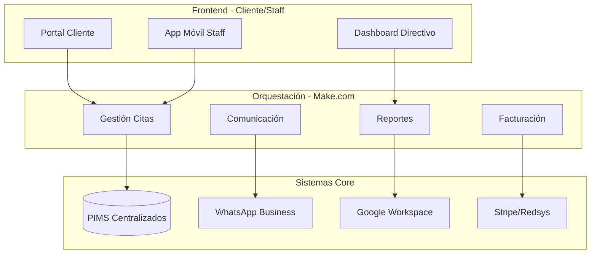
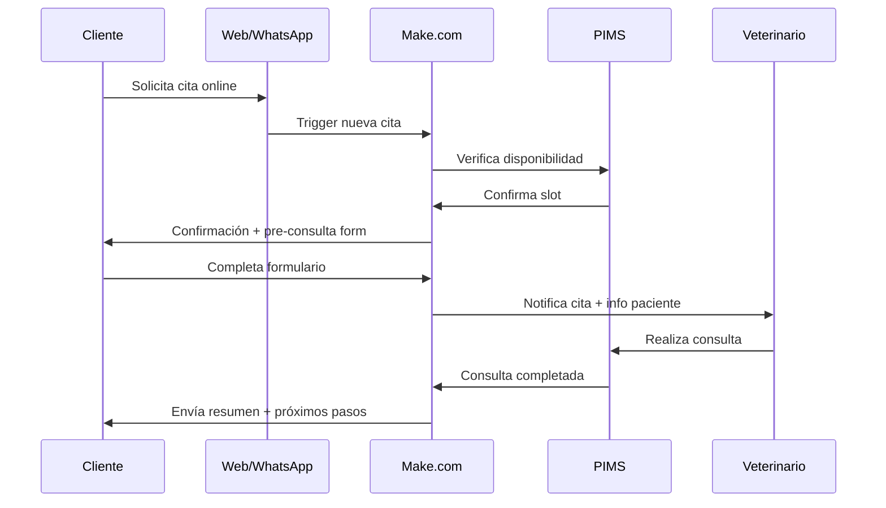

## Resumen ejecutivo
Rediseñamos los procesos administrativos de **4 clínicas** con automatización No-Code, reduciendo tareas repetitivas y mejorando la experiencia del equipo.

<MetricGrid>
  <Metric label="Tiempo admin ↓" value="-40%" />
  <Metric label="Consultas ↑" value="+25%" />
  <Metric label="Satisfacción equipo" value="95%" />
  <Metric label="Payback" value="4 meses" />
</MetricGrid>

<Divider />

## Problema
- Formularios en papel y duplicados.  
- Información descoordinada entre clínicas.  
- 3–4 h/día por veterinario en tareas no clínicas.

## Solución
- Automatización de recordatorios, seguimientos y citaciones.  
- Integración con software clínico existente (API).  
- Cuadros de mando operativos para recepción y responsables.

<Callout type="success" title="Testimonio">
"KADMEIA no solo nos dio tecnología, nos devolvió el tiempo para hacer lo que realmente amamos: cuidar animales."
</Callout>

## Impacto y aprendizajes
1. Estandarización de procesos entre clínicas.  
2. Mejora de indicadores de calidad asistencial.  
3. Formación y adopción gradual del equipo.

<ButtonLink href="/contacto">Hablemos del próximo caso →</ButtonLink>

### Problemática Inicial

#### Gestión de Citas y Comunicación
- 📞 **150+ llamadas diarias** para confirmaciones manuales
- 📋 **Formularios en papel** duplicados entre sedes
- ❌ **25% no-shows** por falta de recordatorios
- 🔄 **Información desincronizada** entre clínicas

#### Procesos Administrativos
- ⏰ **4 horas/día per veterinario** en tareas administrativas
- 📊 **Reportes manuales** semanales que tomaban 8 horas
- 💾 **Datos fragmentados** en múltiples sistemas
- 🧾 **Facturación manual** con errores frecuentes

#### Comunicación Interna
- 📧 **Email overload**: 80+ emails diarios por sede
- 🗂️ **Procedimientos desactualizados** y no estandarizados
- 📋 **Handoffs manuales** entre turnos y sedes
- 📈 **KPIs no monitorizados** en tiempo real

### Impacto Cuantificado

| Problema | Sede Norte | Sede Sur | Sede Este | Sede Oeste | Total |
|----------|------------|----------|-----------|------------|-------|
| **No-shows/semana** | 45 | 38 | 52 | 41 | **176** |
| **Horas admin/día** | 32 | 28 | 35 | 30 | **125h** |
| **Errores facturación/mes** | 15 | 12 | 18 | 14 | **59** |
| **Tiempo reportes/sem** | 8h | 8h | 8h | 8h | **32h** |

> "Estábamos creciendo pero ahogándonos en procesos manuales. Cada sede funcionaba como un silo independiente, perdiendo las ventajas de ser un grupo" - **Dr. Antonio Ruiz, Director Médico**

## La Solución: Ecosistema de Automatización No-Code

Diseñamos un ecosistema integral usando plataformas No-Code que conecta todas las sedes bajo una arquitectura unificada.

### Arquitectura de Solución

### Componentes Implementados

#### 1. Sistema de Citas Inteligente
**Plataforma**: Calendly Pro + Make.com + PIMS integration

**Funcionalidades**:
- **Booking online 24/7** con disponibilidad en tiempo real
- **Recordatorios automáticos** (48h, 24h, 2h antes)
- **Confirmación por WhatsApp** con un clic
- **Reagendación automática** en caso de cancelación
- **Wait-list inteligente** para optimizar horarios

#### 2. Hub de Comunicación Omnicanal
**Stack**: WhatsApp Business API + Twilio + Make.com

**Flujos Automatizados**:
- **Pre-consulta**: Formulario digital 24h antes
- **Post-consulta**: Instrucciones e informes automáticos
- **Seguimiento**: Check-ins a 3, 7 y 30 días
- **Emergencias**: Escalado automático según gravedad
- **Marketing**: Campañas segmentadas por sede y perfil

#### 3. Centro de Comandos Multi-Sede
**Tecnología**: Retool + Google Sheets API + PIMS APIs

**Dashboards**:
- **Operacional**: Citas, ingresos, ocupación por sede
- **Financiero**: Facturación, cobros, gastos consolidados
- **Clínico**: Casos por veterinario, métricas médicas
- **Marketing**: Adquisición, retención, lifetime value

#### 4. Automatización de Procesos Back-Office

##### Facturación Inteligente
- **Generación automática** de facturas post-consulta
- **Envío por email/WhatsApp** según preferencia cliente
- **Seguimiento de pagos** con recordatorios escalonados
- **Reconciliación bancaria** automática con Stripe

##### Gestión de Inventario
- **Alertas automáticas** de stock bajo
- **Órdenes de compra** generadas automáticamente
- **Distribución inter-sedes** optimizada
- **Reporting de rotación** por producto y sede

##### RRHH y Planificación
- **Gestión de turnos** con Calendly + Slack
- **Tracking de horas** automático
- **Evaluaciones digitales** trimestrales
- **Onboarding automatizado** para nuevo staff

## Implementación: Metodología AGILE-NoCode

### Fase 1: Descubrimiento y Arquitectura (Semanas 1-3)

#### Workshop Multi-Sede
- **2 días intensivos** con representantes de cada clínica
- **Mapeo de procesos** actuales (As-Is)
- **Definición del estado objetivo** (To-Be)
- **Priorización de automatizaciones** por impacto/esfuerzo

#### Arquitectura Técnica
- **Diseño del ecosistema** No-Code integrado
- **Definición de APIs** e integraciones
- **Plan de migración** de datos existentes
- **Estrategia de change management**

### Fase 2: MVP y Piloto (Semanas 4-8)

#### Construcción MVP
- **Sede piloto**: Madrid Sur (mayor volumen)
- **Funcionalidades core**: Citas + Comunicación + Reportes básicos
- **Testing intensivo** con usuarios reales
- **Iteración rápida** basada en feedback

#### Validación de Concepto
- **Métricas diarias** de adopción y rendimiento
- **Entrevistas semanales** con usuarios
- **Ajustes de UX/UI** según feedback
- **Documentación de lecciones aprendidas**

### Fase 3: Rollout Escalonado (Semanas 9-16)

#### Despliegue Gradual
- **Semana 9-11**: Sede Este
- **Semana 12-14**: Sede Norte  
- **Semana 15-16**: Sede Oeste
- **Semana 17**: Consolidación y optimización

#### Change Management
- **Formación presencial** de 4 horas por sede
- **Champions internos** para soporte peer-to-peer
- **Hotline técnica** durante primeras 2 semanas
- **Documentación visual** de procesos

### Fase 4: Optimización y Expansión (Semanas 17-24)

#### Analytics y Mejora Continua
- **A/B testing** de flujos automatizados
- **Optimización de conversión** en formularios
- **Refinamiento de reglas** de negocio
- **Expansión a nuevos casos de uso**

## Resultados Transformacionales

### Métricas Operacionales

| KPI | Antes | Después | Mejora |
|-----|-------|---------|--------|
| **No-shows semanales** | 176 | 44 | **-75%** |
| **Tiempo admin/veterinario/día** | 4h | 1.2h | **-70%** |
| **Tiempo generación reportes** | 32h/sem | 2h/sem | **-94%** |
| **Errores facturación/mes** | 59 | 8 | **-86%** |
| **Respuesta a consultas** | 4.2h | 15min | **-94%** |

### Impacto Financiero Anual

#### Ahorros Operacionales
- **Reducción horas administrativas**: 125h → 37.5h/día = **€85,400/año**
- **Eliminación errores facturación**: €15,600 ahorrados
- **Reducción no-shows**: 132 citas/sem × €65 promedio = **€445,380/año**
- **Automatización reportes**: 30h/sem × €25/hora = **€39,000/año**

#### Incremento de Ingresos
- **Mayor aprovechamiento de slots**: +18% ocupación = **€156,000/año**
- **Upselling automatizado**: +12% servicios adicionales = **€89,400/año**
- **Retención mejorada**: +8% client lifetime value = **€67,200/año**

**ROI Total**: **3,048%** en el primer año

### Satisfacción y Adopción

#### Staff Satisfaction
- **NPS interno**: 34 → 81 (+138% mejora)
- **Tiempo dedicado a pacientes**: +2.8h/día por veterinario
- **Stress por tareas administrativas**: -89% según surveys

#### Client Experience
- **CSAT general**: 78% → 94% (+16 puntos)
- **Tiempo espera respuestas**: 4.2h → 15min
- **Facilidad para agendar**: 6.2/10 → 9.1/10

> "Ahora puedo enfocarme 100% en mis pacientes. El sistema maneja toda la parte administrativa automáticamente" - **Dra. Isabel Moreno, Veterinaria Senior**

## Tecnologías y Stack No-Code

### Plataformas Core

#### Make.com (Orquestador Principal)
- **1,247 escenarios activos** ejecutándose
- **45,000+ operaciones/mes** procesadas
- **99.7% uptime** promedio
- **Integraciones**: 23 servicios conectados

#### Retool (Dashboards y Admin)
- **8 dashboards operacionales** multi-sede
- **Real-time data** desde múltiples fuentes
- **Role-based access** para diferentes usuarios
- **Mobile-responsive** design

#### Calendly Pro (Gestión de Citas)
- **Round-robin scheduling** entre veterinarios
- **Buffer times** automáticos entre citas
- **Integración bidireccional** con PIMS
- **Custom confirmation emails** por tipo de cita

### Integraciones Clave

| Sistema | Función | Método Integración |
|---------|---------|-------------------|
| **VetsPro PIMS** | Gestión clínica | API REST + Webhooks |
| **WhatsApp Business** | Comunicación | Official Cloud API |
| **Google Workspace** | Productividad | OAuth 2.0 + Drive API |
| **Stripe/Redsys** | Pagos | Webhook + API |
| **Twilio** | SMS/Voice | REST API |
| **Mailchimp** | Email marketing | API v3.0 |

### Arquitectura de Datos

#### Data Warehouse Central
- **Google BigQuery** como repositorio central
- **ETL diarios** desde todas las fuentes
- **Data retention** policy de 7 años
- **Backup automático** en múltiples regiones

## Casos de Uso Específicos

### Automatización 1: Flujo de Nueva Consulta

**Tiempo total proceso**: 2 minutos (vs. 25 minutos manual)

### Automatización 2: Seguimiento Post-Operatorio

**Trigger**: Paciente marcado como "post-quirúrgico" en PIMS

**Flujo automático**:
1. **Day +1**: WhatsApp con instrucciones específicas de cuidado
2. **Day +3**: Check-in automático sobre evolución
3. **Day +7**: Recordatorio revisión presencial si aplica
4. **Day +14**: Encuesta de satisfacción
5. **Day +30**: Seguimiento de largo plazo

**Resultado**: 98% compliance vs. 34% manual

### Automatización 3: Gestión de Emergencias

**Sistema de Triaje Automático**:
- **Nivel 1**: Auto-derivación a urgencias 24h
- **Nivel 2**: Contacto inmediato con veterinario de guardia
- **Nivel 3**: Cita prioritaria mismo día
- **Nivel 4**: Cita regular con seguimiento

**Escalado**: SLA de respuesta &lt;5 minutos para emergencias

## Desafíos y Soluciones

### Desafío 1: Resistencia al Cambio Multi-Generacional

**Problema**: Staff senior reticente a cambios tecnológicos

**Solución**:
- **Buddy system**: Pairing junior-senior durante transición
- **Training personalizado** por perfil generacional
- **Wins rápidos** para mostrar beneficios inmediatos
- **Respeto por workflow preferences** donde posible

### Desafío 2: Sincronización Multi-Sede

**Problema**: Mantener coherencia entre 4 ubicaciones diferentes

**Solución**:
- **Single source of truth** centralizado
- **Real-time sync** con conflict resolution
- **Rollback procedures** ante inconsistencias
- **Cross-sede reporting** unificado

### Desafío 3: Complejidad de Integraciones

**Problema**: 23 sistemas diferentes a conectar

**Solución**:
- **API-first approach** con documentación exhaustiva
- **Middleware layer** para normalizar datos
- **Error handling** robusto con alertas
- **Monitoring 24/7** de todas las integraciones

### Desafío 4: Escalabilidad y Rendimiento

**Problema**: Crecimiento exponencial de operaciones automatizadas

**Solución**:
- **Horizontal scaling** de procesos Make.com
- **Caching strategies** para consultas frecuentes
- **Load balancing** entre instancias
- **Performance monitoring** continuo

## Lecciones Aprendidas

### Factores Críticos de Éxito

1. **Executive Sponsorship**: Apoyo visible de dirección
2. **Change Champions**: Identificar y empoderar early adopters
3. **Iteración Rápida**: Builds pequeños, feedback continuo
4. **User-Centric Design**: Procesos diseñados desde la perspectiva del usuario final
5. **Measurement Culture**: KPIs claros desde día uno

### Best Practices No-Code Enterprise

#### Governance y Documentación
- **Center of Excellence** para No-Code
- **Standards y templates** reutilizables
- **Documentation as code** approach
- **Regular audits** de automatizaciones

#### Security y Compliance
- **Data encryption** en reposo y tránsito
- **Role-based access control** granular
- **Audit logs** completos
- **GDPR compliance** por diseño

#### Escalabilidad y Mantenimiento
- **Modular architecture** para fácil extensión
- **Automated testing** de flujos críticos
- **Disaster recovery** procedures
- **Regular performance optimization**

## Roadmap Futuro (2025-2026)

### Q1 2025: IA Predictiva
- **Predicción de no-shows** con ML
- **Dynamic pricing** basado en demanda
- **Inventory forecasting** avanzado
- **Client churn prediction**

### Q2 2025: Expansión Geográfica
- **Onboarding automatizado** para nuevas sedes
- **Template replication** de automatizaciones
- **Multi-region deployment** de infraestructura
- **Localization** de procesos por región

### Q3 2025: Cliente Self-Service
- **Portal cliente avanzado** con historial completo
- **Telemedicina integrada** para consultas menores
- **AI chatbot** para soporte 24/7
- **Loyalty program** automatizado

### Q4 2025: Advanced Analytics
- **Predictive analytics** para diagnósticos
- **Business intelligence** avanzado
- **Competitive benchmarking** automatizado
- **ROI modeling** por proceso automatizado

## Testimonios del Equipo

### Dirección Ejecutiva

> "La automatización nos ha permitido crecer de 4 a 6 sedes en el último año manteniendo los mismos costes operacionales. Es la diferencia entre ser un grupo de clínicas y ser una verdadera empresa escalable" - **Sr. Carlos Mendoza, CEO**

### Equipo Veterinario

> "Recuperé mi pasión por la veterinaria. Ahora paso 6 horas diarias con pacientes instead of 2 horas con papeles y 4 horas con administrativa" - **Dr. Patricia López, Veterinaria Madrid Norte**

### Staff Administrativo

> "Al principio tenía miedo de que la tecnología me reemplazara. Ahora me doy cuenta de que me ha permitido enfocarme en tareas de mayor valor: cuidar la experiencia del cliente en lugar de procesar formularios" - **Carmen Jiménez, Recepcionista Senior**

### Clientes

> "Es increíble: reservo cita desde el móvil, recibo recordatorios automáticos, y después de la consulta me llegan las instrucciones por WhatsApp. Todo sin tener que llamar ni esperar" - **Miguel Ruiz, Cliente desde 2020**

## Conclusión y Replicabilidad

El proyecto Madrid Sur Veterinary Group demuestra que **la automatización No-Code puede transformar radicalmente** grupos veterinarios multi-sede, creando eficiencias operacionales masivas mientras mejora la experiencia tanto del staff como de los clientes.

### Factores Clave del Éxito

✅ **Enfoque holístico**: Automatización end-to-end vs. soluciones puntuales  
✅ **Change management estructurado**: Personas antes que tecnología  
✅ **Arquitectura escalable**: Diseñado para crecimiento desde día uno  
✅ **Métricas claras**: ROI cuantificable en múltiples dimensiones  
✅ **Continuous improvement**: Cultura de optimización permanente  

### Aplicabilidad a Otros Grupos

Este modelo es **directamente replicable** en:
- Grupos veterinarios de 3+ sedes
- Clínicas con >50 consultas/semana por sede  
- Organizaciones with appetite for digital transformation
- Teams dispuestos a invertir en change management

**Tiempo de implementación típico**: 4-6 meses  
**ROI esperado**: 300-500% en primer año  
**Prerequisitos**: Apoyo ejecutivo + PIMS con API disponible

**¿Listo para automatizar tu grupo veterinario?** [Contáctanos](/contacto) para un assessment completo y roadmap personalizado.