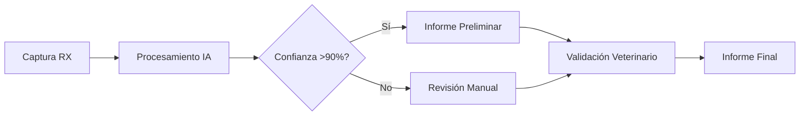

# Clínica Barcelona Norte: Transformación Digital con IA

## Resumen Ejecutivo

**Cliente:** Clínica Veterinaria Barcelona Norte  
**Sector:** Medicina veterinaria de pequeños animales  
**Ubicación:** Barcelona, España  
**Duración del proyecto:** 4 meses  
**Inversión:** €12,000  

## El Desafío

La Clínica Barcelona Norte, con más de 150 consultas semanales, enfrentaba serios cuellos de botella en su departamento de diagnóstico por imagen:

### Problemática Inicial
- ⏱️ **Tiempo de interpretación**: 25-30 minutos por estudio radiológico
- 👥 **Dependencia del especialista**: Solo 1 radiólogo disponible 3 días/semana
- 📈 **Lista de espera creciente**: Hasta 5 días para diagnósticos no urgentes
- 💰 **Costes externos**: €15,000/año en consultoría radiológica externa
- 😞 **Satisfacción del cliente**: 72% según encuestas internas

### Impacto en el Negocio
> "Estábamos perdiendo clientes por los retrasos en diagnósticos. Los propietarios no entendían por qué tenían que esperar una semana para saber si su mascota tenía una fractura simple" - **Dra. Carmen Ruiz, Directora Médica**

## La Solución KADMEIA

Diseñamos e implementamos una solución integral de IA diagnóstica integrada con su PIMS existente (Vetersuite).

### Componentes Técnicos

#### 1. Motor de IA Diagnóstica
- **Algoritmo especializado** en radiología veterinaria
- **Detección automática** de fracturas, displasias y masas
- **Scoring de confianza** para cada diagnóstico
- **Integración DICOM** nativa

#### 2. Flujo de Trabajo Optimizado

#### 3. Dashboard de Monitorización
- **Métricas en tiempo real** de rendimiento
- **Alertas automáticas** para casos complejos
- **Analytics de productividad**
- **Informes de calidad** mensuales

### Metodología de Implementación

#### Fase 1: Análisis y Configuración (Semanas 1-2)
- Auditoría del flujo actual de diagnóstico por imagen
- Configuración del entorno de IA
- Integración con Vetersuite PIMS
- Setup del sistema PACS

#### Fase 2: Entrenamiento y Piloto (Semanas 3-6)
- Formación del equipo en el nuevo sistema
- Período de validación paralela (IA vs. diagnóstico tradicional)
- Ajustes basados en casos reales
- Optimización de algoritmos específicos

#### Fase 3: Despliegue Completo (Semanas 7-12)
- Migración completa al nuevo flujo
- Monitorización continua de KPIs
- Soporte técnico intensivo
- Documentación de procedimientos

#### Fase 4: Optimización (Semanas 13-16)
- Análisis de resultados y mejoras
- Implementación de feedback del equipo
- Expansión a casos más complejos
- Planificación de escalabilidad

## Resultados Obtenidos

### Métricas de Rendimiento

| Métrica | Antes | Después | Mejora |
|---------|--------|---------|--------|
| **Tiempo diagnóstico** | 25-30 min | 8-12 min | **-60%** |
| **Capacidad diaria** | 12 estudios | 20 estudios | **+67%** |
| **Tiempo de espera** | 3-5 días | 24-48 horas | **-75%** |
| **Precisión diagnóstica** | 92% | 96% | **+4%** |

### Impacto Financiero (Primer Año)

#### Ahorros Operacionales
- **Reducción consultoría externa**: €15,000 → €3,000 = **€12,000 ahorrados**
- **Optimización tiempo veterinario**: 15h/semana × €40/hora = **€31,200 ahorrados**
- **Reducción re-tomas**: 15% → 5% = **€4,800 ahorrados**

#### Incremento de Ingresos
- **Mayor throughput**: +67% capacidad = **€28,000 adicionales**
- **Servicios premium**: Diagnóstico express = **€8,500 adicionales**

**ROI Total**: **247%** en el primer año

### Satisfacción del Cliente

> "El cambio ha sido espectacular. Ahora puedo dar resultados el mismo día de la radiografía. La confianza de los clientes ha aumentado notablemente" - **Dr. Miguel Santos, Veterinario Senior**

#### Métricas de Satisfacción
- **NPS (Net Promoter Score)**: 42 → 78 (+86% mejora)
- **Tiempo de respuesta**: 72 → 4 horas promedio
- **Quejas por retrasos**: 15/mes → 1/mes (-93%)

## Tecnologías Implementadas

### Stack Técnico

#### Software Core
- **IA Engine**: TensorFlow-based custom model
- **PIMS Integration**: Vetersuite API v3.2
- **PACS**: Orthanc open-source DICOM server
- **Dashboard**: React + D3.js analytics

#### Hardware
- **Servidor local**: Dell PowerEdge R740
- **GPU acceleration**: NVIDIA Tesla T4
- **Storage**: 10TB RAID 10 para imágenes DICOM
- **Networking**: Gigabit ethernet con backup 4G

#### Integraciones
- **Laboratorio externo**: API para correlación de resultados
- **Sistema de citas**: Sincronización bidireccional
- **Facturación**: Automatización de códigos diagnósticos
- **Comunicación**: WhatsApp Business para notificaciones

## Desafíos y Soluciones

### Desafío 1: Resistencia al Cambio
**Problema**: Algunos veterinarios senior mostraron reticencia inicial

**Solución**:
- Programa de mentoring peer-to-peer
- Demostración de casos exitosos
- Respeto por la validación manual final
- Formación gradual y personalizada

### Desafío 2: Integración Técnica
**Problema**: Complejidad de integración con sistemas legacy

**Solución**:
- API middleware personalizada
- Migración gradual de datos
- Backup systems para continuidad
- Testing exhaustivo en paralelo

### Desafío 3: Gestión de Expectativas
**Problema**: Expectativas irreales sobre precisión de IA al 100%

**Solución**:
- Comunicación transparente de limitaciones
- Sistema de confianza y escalado manual
- Continuous improvement basado en feedback
- Educación sobre IA como herramienta de apoyo

## Lecciones Aprendidas

### Factores de Éxito
1. **Involvement del equipo** desde el diseño
2. **Integración gradual** vs. big-bang
3. **Validación clínica** continua
4. **Soporte técnico** intensivo inicial
5. **Métricas claras** de rendimiento

### Mejores Prácticas
- Mantener siempre la **supervisión humana**
- Implementar **feedback loops** para mejora continua
- Establecer **protocolos de escalado** para casos complejos
- Documentar **todos los procesos** exhaustivamente

## Siguientes Pasos

### Expansión Planificada
- **Ecografía con IA**: Q2 2025
- **Análisis de laboratorio**: Q3 2025
- **Predicción de patologías**: Q4 2025
- **Integración multi-sede**: Q1 2026

### ROI Proyectado (3 años)
- **Año 1**: €84,300 (ROI 247%)
- **Año 2**: €116,400 (ROI acumulado 387%)
- **Año 3**: €142,800 (ROI acumulado 521%)

## Testimonios

### Equipo Clínico

> "La IA no ha reemplazado mi criterio médico, sino que lo ha potenciado. Ahora puedo dedicar más tiempo a casos complejos mientras los casos rutinarios se procesan de forma más eficiente" - **Dra. Laura Fernández, Veterinaria**

### Dirección

> "La inversión se pagó sola en menos de 8 meses. Pero más allá de los números, hemos mejorado significativamente la experiencia de nuestros clientes y la satisfacción de nuestro equipo" - **Sr. Pedro Martín, Gerente**

### Clientes

> "Ahora traigo a mi perro aquí porque sé que en el mismo día tendré el diagnóstico. Es increíble cómo han mejorado" - **María González, Cliente desde 2019**

## Conclusión

La implementación de IA en la Clínica Barcelona Norte demuestra que la **tecnología, cuando se implementa thoughtfully, puede transformar radicalmente** la eficiencia operacional sin comprometer la calidad del cuidado veterinario.

**Elementos clave del éxito**:
- ✅ Enfoque gradual y colaborativo
- ✅ Integración técnica robusta
- ✅ Formación continua del equipo
- ✅ Métricas claras de ROI
- ✅ Mantenimiento de la supervisión clínica

**¿Interesado en implementar IA en tu clínica?** [Contáctanos](/contacto) para una consulta gratuita y evaluación de viabilidad.